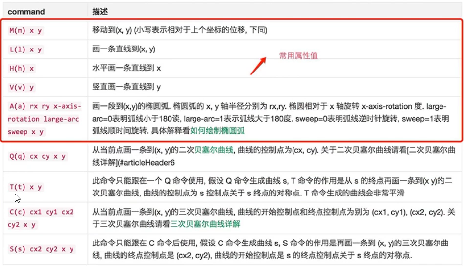

# SVG_study
学习SVG动画

## 一.概述

svg是一种基于xml语法的图像格式,全称是可缩放矢量图(Scalable Vector Graphics).

### 1.使用svg的多种方式

* svg标签形式

  * ```html
    <svg></svg>
    ```

* img标签形式:  

  * ```shell
    
    ```

* iframe标签形式: 

  * ```shell
    <iframe src="img/杯子蛋糕.svg" scrolling="no" width="200" height="200" frameborder="0"></iframe>
    ```

* object标签形式:

  * ```shell
    <object data="img/杯子蛋糕.svg" type="image/svg+xml"></object>
    ```

* embed标签:

  * ```shell
    <embed src="img/杯子蛋糕.svg" type="image/svg+xml">
    ```

* css也可以使用svg文件.

  * ```xml
    .logo{
    	background:url(icon.svg)
    }
    ```

* svg文件还可以转换为BASE64编码,然后作为Data URL写入网页.

  * ```html
    
    ```

## 二.语法

### 2.1`<svg>`标签

SVG代码都放在顶层标签<svg>之中.下面是一个例子.

```xml
<svg width="100%" height="100%">
<circle id="myCircle" cx="50" cy="50" r="50"/>
</svg>
```

* **width**和**height**属性,制定了SVG图像在HTML元素中所占据的宽度和高度.除了相对单位,也可以采用绝对单位(单位:像素).如果不指定这两个属性,**svg图像默认大小是300像素(宽)*150像素(高).**

* 如果只想展示SVG图像的一部分,就要指定**viewBox**属性.

  * 

    ```xml
    <svg width="100" height="100" viewBox="50 50 50 50">
    <circle cx="50" cy="50" r="50"/>
    </svg>
    ```

  * viewBox属性的值有四个数字,分别是**左上角的横坐标和纵坐标**,**视口的宽度和高度**

  * 如果svg不指定width和height属性,只指定viewBox属性,则相当于只给定svg图像的长宽比.这时,svg图像的默认大小将等于svg元素的父元素可容纳的最大大小.

### 2.2.`<circle>`标签

`<circle>`标签代表圆形.

```xml
<svg width="200" height="200">
    <circle cx="100" cy="100" r="25" fill="pink"/>
    <circle cx="170" cy="170" r="5" class="bgred"/>
    <circle cx="50" cy="50" r="10" class="bgblue"/>
</svg>
```


* cx,cy,r属性分别为横坐标,纵坐标,和半径,单位为像素.

* class属性用来指定对应的css类.

  * ```css
    .bgred{
    	fill: mediumpurple;
    }
    .bgblue{
        fill: deepskyblue;
        stroke: red;
        stroke-width: 3px;
    }
    ```

  * svg的css属性与网页元素有所不同.

    * fill: 填充色
    * stroke: 秒变色
    * stroke-width: 边框宽度

### 2.3.`<line>`标签

`<line>`标签用来绘制直线.

```xml
<svg width="300" height="180">
	<line x1="0" y1="0" x2="200" y2="0" style="stroke:rgb(0,0,0);stroke-width:5"/>
</svg>
```

* x1,y1表示线段起始点的横坐标和纵坐标,x2和y2表示线段终点的横坐标和纵坐标;style表示样式属性

### 2.4.`<polyline>`标签

```xml
<svg>
	<polyline points="50,100 50,300 350,300" style="fill:no;stroke:deeppink;stroke-width:5px;"/>
</svg>
```

* points属性指定了每个端点的坐标,横坐标与纵坐标之间用**逗号**分割,点与点之间用**空格**分隔

### 2.5.`<rect>`标签

`<rect>`标签用于绘制矩形.

```xml
<svg width="400" height="400">
	<rect x="50" y="50" width="250" height="250" class="rect" />
</svg>
```

* x,y属性指定了矩形的左上角坐标,width,height属性指定了矩形的宽和高

### 2.6.`<ellipse>`标签

`<ellipse>`标签用于绘制椭圆

```xml
<svg width="400" height="400">
    <ellipse cx="60" cy="60" rx="20" ry="40"></ellipse>
</svg>
```

* cx,cy指定了椭圆中心的横坐标和纵坐标(单位像素);rx属性和ry属性,指定了椭圆横向轴和纵向轴的半径(单位像素)

### 2.7.`<polygon>`标签用于绘制多边形

```xml
<svg width="300" height="180">
	<polygon fill="green" stroke="orange" stroke-width="1" points="0,0 100,0 100,100 0,100 0,0"/>
</svg>
```

* `<polygon>`的points属性指定了每个端点的坐标,横坐标与纵坐标之间用逗号分隔,点与点之间用空格分隔.

### 2.8.`<path>`标签

`<path>`标签用于绘制路径.

```xml
<svg width="300" height="180">
	<path d="
    	M 18,3
        L 46,3
        L 46,40
        L 61,40
        L 32,68
        L 3,40
        L 18,40
        Z
    "></path>
</svg>
```

* d属性表示绘制顺序,值是一个长字符串,**每个字母表示一个绘制动作**,后面跟着坐标.
  * M:移动到(moveto)
  * L:画直线到(lineto)
  * Z:闭合路径



### 2.9.`<text>`标签

`<text>`标签用于绘制文本.

```xml
<svg width="300" height="180">
	<text x="50" y="25">Hello World</text>
</svg>
```

* x,y表示文本区块基线起点的纵坐标和横坐标
* text的样式中文字的颜色不再用color来设定,二十用**fill**

### 2.10.`<use>`标签

`<use>`标签用于复制一个形状.

```xml
<svg width="600" height="600">
    <circle id="circle1" cx="200" cy="200" r="50" fill="orange" stroke="skyblue" stroke-width="10"></circle>
    <use href="#circle1" x="200" y="200" ></use>
</svg>
```

* href属性指定所要复制的节点,x属性和y属性是左上角的坐标(距离复制的节点的纵距离和横距离).另外,还可以指定width和height坐标.

### 2.11.`<g>`标签

`<g>`标签用于将多个形状组成一个组(group),方便复用

```xml
<svg width="600" height="1200">
    <g id="miqi">
        <circle cx="100" cy="100" r="50"></circle>
        <circle cx="500" cy="100" r="50"></circle>
        <circle cx="300" cy="300" r="200"></circle>
    </g>
    <use href="#miqi" x="0" y="450"></use>
</svg>
```

### 2.12.`<defs>`标签

`<defs>`标签用于自定义形状,它内部的代码不会显示,仅供引用.

```xml
<svg width="600" height="1200">
    <defs>
        <g id="miqi">
            <circle cx="100" cy="100" r="50"></circle>
            <circle cx="500" cy="100" r="50"></circle>
            <circle cx="300" cy="300" r="200"></circle>
        </g>
    </defs>

    <use href="#miqi" x="0" y="450"></use>
</svg>
```

### 2.13.`<patten>`标签

`<patten>`标签用于自定义一个形状,该形状可以被引用来平铺一个区域.

```html
<svg width="500" height="500">
	<defs>
    	<pattern id="dots" x="0" y="0" width="100" height="100" patternUnits="userSpaceOnUse">
        	<circle fill="#bee9e8" cx="50" cy="50" r="35"/>
        </pattern>
    </defs>
    <rect x="0" y="0" width="100%" height="100%" fill="url(#dots)"/>
</svg>
```

* 上面代码中,`<pattern>`标签将一个圆形定义为dots模式.patternUnits="userSpaceOnUse"表示`<pattern>`的宽度和长度是实际的像素值.然后,指定这个模式去填充下面的矩形.(是将pattern的宽度和高度固定住，在指定区域内平铺，能铺多少铺多少，超出部分裁掉)

* 当patternUnits="objectBoundingBox"时，我们通过指定width和height来间接规定图案平铺的数量。因为这时，width和height被限制在0~1，或者0%~100%之间，即宽度或高度占填充区域高度或宽度的百分比。可想而知20%放5个，40%放2.5个。

### 2.14.`<image>`标签

`<image>`标签用于插入图片文件.

```html
<svg viewBox="0 0 100 100" width="100" height="100">
	<image xlink:href="path/to/image.jpg" width="50%" height="50%"/>
</svg>
```

* 上面代码中,<image>的xlink:href属性表示图像的来源

### 2.15.`<animate>`标签

`<animate>`标签用于产生动画效果.

```html
<svg width="500px" height="500px">
	<rect x="0" y="0" width="100" height="100" fill="#feac5e">
    	<animate attributeName="x" from="0" to="500" dur="2s" repeatCount="indefinite"/>
    </rect>
</svg>
```

* 上面的代码中,矩形会不断移动,产生动画效果.
* animate的属性含义:
  * attributeName: 发生动画效果的属性名.
  * from: 单次动画的初始值.
  * to: 单词动画的结束值.
  * dur: 单词动画的持续时间.
  * repeatCount: 动画的循环模式.
* 可以再多个属性上面定义动画.

```html
<animate attributeName="x" from="0" to="500" dur="2s" repeatCount="indefinite"/>
<animate attributeName="width" to="500" dur="2s" repeatCount="indefinite"/>
```

2.16.`<animateTransform>`标签

`<animate>`标签对css的transform属性不起作用,如果需要变形,就要使用`<animateTransform>`标签.

```html
<svg width="500px" height="500px">
	<rect x="250" y="250" width="50" height="50" fill="#4bc0c8">
    	<animateTransform attributeName="transform" type="rotate" begin="0s" dur="10s" from="0 200 200" to="360 400 400" repeatCount="indefinite"/>
    </rect>
</svg>
```

* 上面代码中 ,`<animateTransform>`的效果为旋转(rotate),这时from和to属性值有三个数字,第一个数字是角度值,第二个值和第三个值是旋转中心的坐标.from="0 200 200"表示开始时,角度为0,围绕(200,200)开始旋转;to="360 400 400"表示结束时,角度为360,围绕(400,400)旋转.

## 三.svg环形进度条

* index.html文件内容如下:

```html
<!DOCTYPE html>
<html lang="en">
<head>
  <meta charset="UTF-8">
  <meta http-equiv="X-UA-Compatible" content="IE=edge">
  <meta name="viewport" content="width=device-width, initial-scale=1.0">
  <title>Document</title>
  <style>
    .text{
      /* 文本水平居中 */
      text-anchor: middle;
      dominant-baseline: middle;
    }
    body{
      text-align: center;
    }
  </style>
</head>
<body>
  <svg width="700" height="700">
    <!-- 设置底色的圆环 -->
    <circle cx="350" cy="350" r="300"
      fill="none" stroke="gray"
      stroke-width="40" stroke-linecap="round"/>
    
    <!-- 设置进度条 -->
    <circle class="progress"
      transform="rotate(-90,350,350)"
      cx="350" cy="350" r="300"
      fill="none" stroke="red"
      stroke-width="40"
      stroke-linecap="round"
      stroke-dasharray="0,10000"/>
    <!-- stroke-dasharray:一个表示长度,一个表示间距 -->
    <!-- 设置文本 -->
    <text class="text" x="350" y="350"
      font-size="200" fill="red">0</text>
  </svg>
  <script src="js/index.js"></script>
</body>
</html>
```

* index.js文件

```shell
var processDom = document.querySelector(".progress")
var textDom = document.querySelector(".text")
function rotateCircle (percent) {
  // 获取svg圆形环的总长,通过获取半径长度算出总长
  var circleLength = Math.floor(2 * Math.PI * parseInt(processDom.getAttribute("r")));
  // 按照百分比,算出进度环的长度
  var value = percent*circleLength/100;
  // 红色rgb是255,0,0
  // 蓝色rgb是0,191,255
  var red = 255 + parseInt((0-255)/100*percent);
  var green = 0 + parseInt((191-0)/100*percent);
  var blue = 0 + parseInt((255-0)/100*percent);
  // 设置stroke-dasharray和路径的颜色
  processDom.setAttribute('stroke-dasharray', value + ", 10000");
  processDom.setAttribute('stroke', `rgb(${red},${green},${blue})`);
  // 设置文本内容和颜色
  textDom.innerHTML = percent + '%';
  textDom.setAttribute("fill", `rgb(${red},${green},${blue})`)
}

// 30毫秒变化将进度+1
let num = 0;
setInterval(() => {
  num++;
  if(num>100){
    num = 0
  }
  rotateCircle(num)
},30)
```

